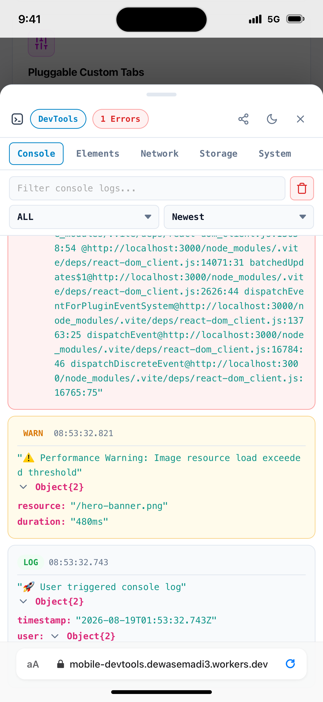
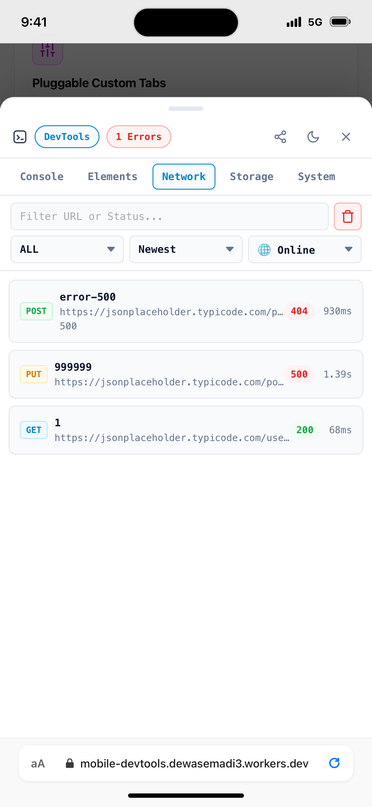
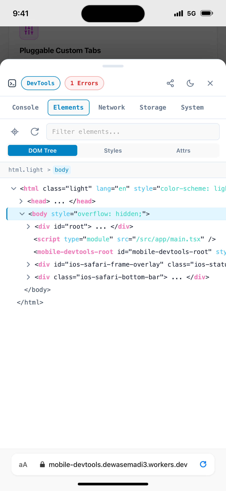
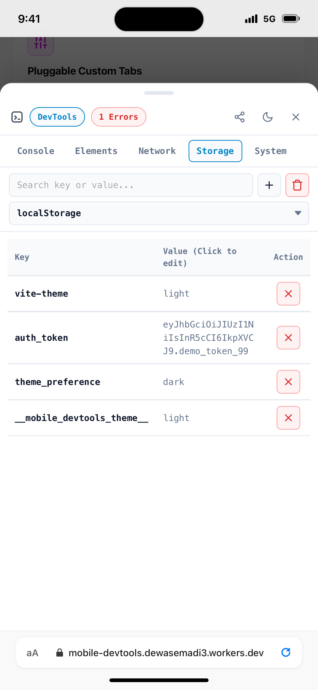
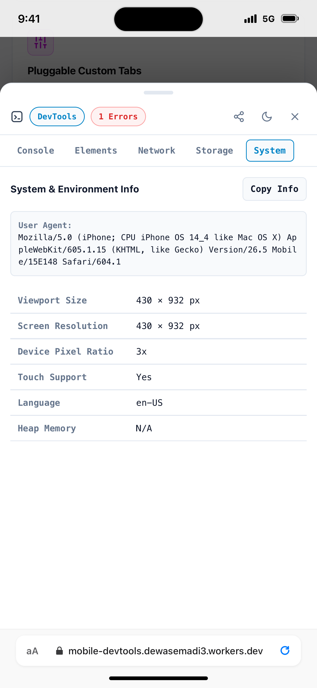

# 03. Core Features Breakdown

`mobile-devtools` packs a comprehensive suite of mobile debugging features into a single, lightweight overlay drawer.

---

## 📋 1. Console Inspector (`Console Tab`)

The Console Tab intercepts all JavaScript log output in real time.

### Capabilities:

- **2-Row Mobile Toolbar Layout**: Optimized 2-row toolbar featuring a full-width search input (`Filter console logs...`) alongside action buttons and dropdowns.
- **Log Level Filters**: Filter logs by `All`, `LOG`, `INFO`, `WARN`, `ERROR`, and `DEBUG`.
- **Log Sorting**: Sort logs dynamically by `Newest`, `Oldest`, `Errors`, or `Frequent`.
- **Interactive JSON Tree**: Expandable object inspector (`<json-tree>`) with SVG chevron toggle arrows for deep nested JS objects, arrays, functions, and primitive values.
- **Unread Error Badge**: The floating badge automatically highlights error counts (`🔴 2`) and warning counts (`🟡 1`) when unread errors occur while the drawer is closed.
- **Clear Logs**: 1-click clear log button to purge the current log buffer.

---

## 🌐 2. Network Inspector (`Network Tab`)

The Network Tab monitors all outgoing and incoming HTTP network traffic.

### Capabilities:

- **2-Row Mobile Toolbar Layout**: Row 1 contains a full-width search bar + Clear button; Row 2 holds scroll-guarded `Method`, `Sort / Status Breakdown`, and `Throttling` dropdowns.
- **Interception Scope**: Automatically patches `window.fetch`, `XMLHttpRequest` (XHR), native `WebSocket`, and `EventSource` (Server-Sent Events / SSE).
- **Unified Sort & HTTP Status Breakdown Filter**: Select from `Newest`, `Oldest`, `Slowest`, `Fastest`, `2xx Success`, `3xx Redirect`, `4xx Client Error`, `5xx Server Error`, `1xx Info`, or `Network Error`.
- **WebSocket & SSE Frames**: Renders real-time message frames (sent and received messages) with SVG direction icons (`ARROW_UP_ICON` Sent, `ARROW_DOWN_ICON` Received), high-precision timestamps, and interactive JSON payload syntax tree structures.
- **HTTP Status Badge**: Visual status pill (`200 OK` in green, `404 Not Found` in yellow, `500 Internal Server Error` in red, `101 Switching Protocols` for active WebSockets).
- **Timing & Latency**: Exact request latency timing measured in milliseconds (`45 ms`).
- **Headers & Payloads**: Full view of Request Headers, Response Headers, Query Parameters, Request Body, and Response Body.
- **JSON Syntax Highlighter**: Formatted JSON response viewer.
- **Network Throttling Simulator**: Simulate poor mobile connection conditions directly on physical devices:
  - `Online` (Normal unthrottled connection)
  - `Fast 3G` (1.5 Mbps down / 750 Kbps up, 50ms latency)
  - `Slow 3G` (400 Kbps down / 150 Kbps up, 400ms latency)
  - `Offline` (Simulated network disconnect)

---

## 🌳 3. DOM Elements Inspector (`Elements Tab`)

The Elements Tab allows mobile developers to inspect HTML elements and CSS layouts directly on mobile screens without a desktop browser connected.

### Capabilities:

- **HTML DOM Tree Browser**: Collapsible, color-coded HTML node hierarchy showing tag names, attributes, classes, IDs, and text content.
- **Interactive Element Picker**: Tap any element on the mobile web page to highlight its DOM node and inspect its styles immediately.
- **Box Model Viewer**: Visual box model diagram calculating exact computed dimensions for `margin`, `border`, `padding`, and `content`.
- **Grouped Style Categories**: Computed CSS properties organized into collapsible categories:
  - **Layout**: `display`, `position`, `width`, `height`, `z-index`, `overflow`
  - **Flexbox**: `flex-direction`, `justify-content`, `align-items`, `flex-wrap`
  - **Grid**: `grid-template-columns`, `grid-template-rows`, `gap`
  - **Typography**: `font-family`, `font-size`, `font-weight`, `line-height`
  - **Colors**: `color`, `background-color`, `border-color`
- **Reset Selection**: 1-click button to reset target element selection to `<body>`.

---

## 💾 4. Storage Inspector (`Storage Tab`)

Inspect and edit client-side storage mechanisms.

### Capabilities:

- **Storage Engines**: Full support for `localStorage`, `sessionStorage`, `document.cookie`, and `indexedDB` (with context-aware Database & Store selectors).
- **2-Row Mobile Toolbar Layout**: Full-width search bar + Add & Clear action buttons.
- **Live Search**: Filter keys instantly by name or value.
- **Add / Edit / Delete**: Add new key-value pairs, edit existing values inline, or delete individual keys.
- **Clear All**: 1-click button to purge all entries in selected storage engine.

---

## 💻 5. System Diagnostics (`System Tab`)

Real-time device and browser diagnostics monitor.

### Metrics Monitored:

- **Viewport Dimensions**: Width $\times$ Height (`390 x 844 px`).
- **Device Pixel Ratio (DPR)**: Screen pixel density (`dpr: 3`).
- **User Agent**: Complete browser User Agent string.
- **JS Heap Memory**: `usedJSHeapSize` / `totalJSHeapSize` / `jsHeapSizeLimit` (when available via Chrome Memory API).
- **Screen Orientation**: `portrait-primary` or `landscape-primary` with live change listener.

---

## 🚀 6. 1-Click Bug Exporter

Instantly export a comprehensive diagnostic report containing console logs, network requests, device info, and current URL.

- **Web Share API (`navigator.share`)**: Triggers native share sheet to send report via WhatsApp, Slack, Telegram, Email, or AirDrop.
- **Text File Download Fallback**: Generates downloadable `.txt` bug report file.
- **Clipboard Fallback**: Copies formatted markdown bug report to clipboard.
